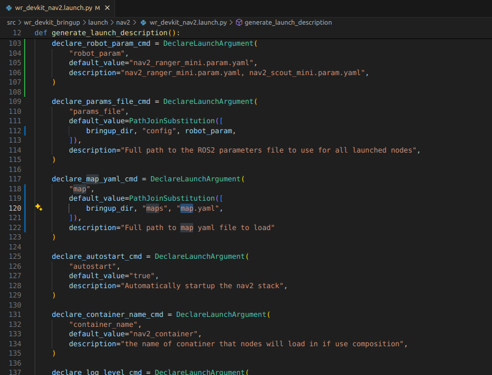

# WR Devkit Navigation


This repository provides a reference setup when using the mobile robot development kit from Weston Robot.

## Requirements

The following hardware configurations are supported:

### Chassis
| Name                     | Documentation                                                       | Source Code                                                        |
| ------------------------ | ------------------------------------------------------------------- | ------------------------------------------------------------------ |
| UGV Development Kit V1.0 | [wiki](https://docs.westonrobot.net/wr_dev_kit/ugv_dev_kit_v1.html) | [ugv_devkit_v1_bringup](./src/kits/chassis/ugv_devkit_v1_bringup/) |

### Sensor Kits
| Sensor kit               | Mount Location | Documentation | Source Code                                                            |
| ------------------------ | -------------- | ------------- | ---------------------------------------------------------------------- |
| Livox Mid360 Lidar + IMU | Top            | TBD           | [mid360_sensor_kit_bringup](./src/kits/top/mid360_sensor_kit_bringup/) |
| W200D Ultrasonic Sensors | Base           | TBD           | [w200d_sensor_kit_bringup](./src/kits/base/w200d_sensor_kit_bringup/)  |

### Robot Bases
| Base            | Documentation                                                                      |
| --------------- | ---------------------------------------------------------------------------------- |
| Ranger Mini 2.0 | [wiki](https://docs.westonrobot.com/robot_user_guide/agilex/ranger_mini_v2.0.html) |
| Scout Mini      | [wiki](https://docs.westonrobot.com/robot_user_guide/agilex/scout_mini.html) |

**Note**: Robot bases are used for testing and development purposed only. Other robot bases should also be compatible with the provided chassis and sensor kits.

### Onboard Computer
| Operating System | Framework                                                                             |
| ---------------- | ------------------------------------------------------------------------------------- |
| Ubuntu 22.04     | [ROS2 Humble](https://docs.ros.org/en/humble/Installation/Ubuntu-Install-Debians.html) |


## Installation

* Install the Weston Robot Platform SDK (wrp-sdk)

    ```bash
    $ sudo install -m 0755 -d /etc/apt/keyrings
    $ curl -fsSL http://deb.westonrobot.net/signing.key | sudo gpg --dearmor -o /etc/apt/keyrings/weston-robot.gpg
    $ sudo chmod a+r /etc/apt/keyrings/weston-robot.gpg

    $ echo \
        "deb [arch=$(dpkg --print-architecture) signed-by=/etc/apt/keyrings/weston-robot.gpg] http://deb.westonrobot.net/$(lsb_release -cs) $(lsb_release -cs) main" | \
        sudo tee /etc/apt/sources.list.d/weston-robot.list > /dev/null

    $ sudo apt-get update
    $ sudo apt-get install wrp-sdk

    # Install drivers for peripherals
    $ sudo apt-get install -y software-properties-common 
    $ sudo add-apt-repository ppa:lely/ppa
    $ sudo apt-get update

    $ sudo apt-get install liblely-coapp-dev liblely-co-tools python3-dcf-tools pkg-config
    ```

    Please refer to [this page](https://docs.westonrobot.com/software/installation_guide.html) for more details of the installation steps.


* Install ugv_sdk dependencies
    ```bash
    sudo apt-get install build-essential git cmake libasio-dev
    ```

* Install Livox SDK2 (if you have the Livox Mid360 Lidar + IMU sensor kit)

    ```bash
    $ cd ~
    $ git clone https://github.com/Livox-SDK/Livox-SDK2.git
    $ cd Livox-SDK2
    $ mkdir build && cd build && cmake .. && make
    $ sudo make install
    ```

    > **Note:** You can build and install the Livox-SDK2 at your preferred places other than "~/Livox-SDK2". And you can optionally remove the "Livox-SDK2" folder after installation.

* Import the ROS driver packages into the workspace and build

    ```bash
    $ cd <your-workspace>/wr_devkit_navigation

    # Clone dependencies
    $ vcs import --recursive src < ./navigation.repos

    $ source /opt/ros/humble/setup.bash
    $ colcon build --symlink-install
    ```

    The build process should finish without any errors.

* Install ROS packages **(Make sure you have ros2 installed first)**
    ```bash
    $ chmod +x ros2_packages.sh
    $ ./ros2_packages.sh
    ```

## Running the packages
Sample launch files can be found in the [wr_devkit_bringup](./src/wr_devkit_bringup/) package. They are meant to be used as a starting point for your own development and can be customized to your needs.

Below is the typical workflow to bring up the robot and run some sample applications.  
**Remember to source the ROS Workspace first and optionally set ROS_DOMAIN_ID**

* Bringup CAN Bus
    ```bash
    $ sudo ip link set can0 up type can bitrate 500000
    $ sudo ip link set can0 txqueuelen 1000
    ```

| Base                       | robot_model            |robot_param                         |
| -------------------------- | ---------------------- |----------------------------------- |
| Ranger Mini 2.0 (default)  | ranger_mini_v2         |nav2_ranger_mini.param.yaml         |
| Scout Mini                 | scout_mini             |nav2_scout_mini.param.yaml          |
> **Note:** Ensure the `robot_model` and `robot_param` arguments in the command line match your specific robot configuration. Adjust the launch file as necessary to align with your hardware and software setup

### Sample 2D SLAM ([Cartographer Mapping](https://google-cartographer-ros.readthedocs.io/en/latest/index.html))

* Bringup Robot
    ```bash
    $ ros2 launch wr_devkit_bringup wr_devkit_platform.launch.py robot_model:=ranger_mini_v2
    ```

* SLAM
    ```bash
    $ ros2 launch wr_devkit_bringup wr_devkit_cartographer.launch.py

    # Control via RC or teleop
    $ ros2 run teleop_twist_keyboard teleop_twist_keyboard.py
    ```
    > **Note:** The speed should be slow during the mapping process. If the speed is too fast, the map quality will be affected

* Map Saving
    ```bash
    $ cd Workspace/wr_devkit_navigation/src/wr_devkit_bringup/maps
    $ ros2 run nav2_map_server map_saver_cli -f <your_map_name>
    ```

### Sample Navigation ([Nav2](https://docs.nav2.org/index.html))

* Bringup Robot
    ```bash
    $ ros2 launch wr_devkit_bringup wr_devkit_platform.launch.py robot_model:=ranger_mini_v2
    ```

* Launch Nav2
    ```bash
    $ ros2 launch wr_devkit_bringup wr_devkit_nav2.launch.py robot_param:=nav2_ranger_mini.param.yaml
    ```

    * Map to odom frame will not be published until you provide an initial pose estimate 
    * You can run rviz2 on another pc via
      ```bash
      $ ros2 launch nav2_bringup rviz_launch.py
      ```
    * If you need to change the map, open the `wr_devkit_nav2.launch.py` file to replace the parameter `map` with the name of the map you want to use. The file is located at `~/Workspace/wr_devkit_navigation/src/wr_devkit_bringup/launch/nav2/`
      


## Notes
* The sample applications (Nav2/SLAM) are designed to be ran separately and should not be ran at the same time.
