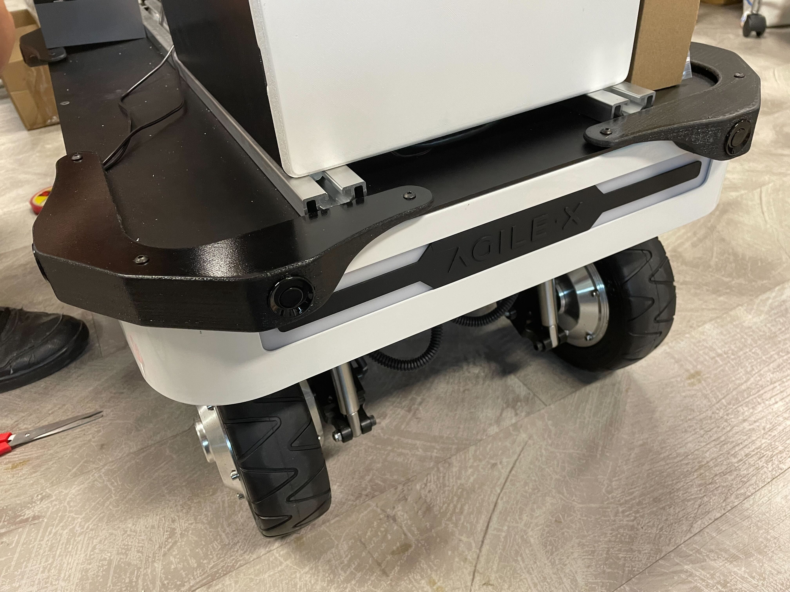

# W200d Ultrasonic Sensor Kit Bringup



## Overview
This package contains launch and config files to launch Weston Robot's W200d Ultrasonic Sensor Kit (base).

## Usage
To launch the W200d Ultrasonic Sensor Kit, use the provided launch file:
```bash
ros2 launch w200d_sensor_kit_bringup sensor_kit.launch.py
```

## Launch Files
* [sensor_kit.launch.py](./launch/sensor_kit.launch.py)
  | Argument      | Description                                                                                                            | Default Value |
  | ------------- | ---------------------------------------------------------------------------------------------------------------------- | ------------- |
  | use_namespace | Whether to apply a namespace                                                                                           | False         |
  | namespace     | Top-level namespace                                                                                                    | ""            |
  | robot_base    | Robot base type</br>Determines what offset to use.</br>See [offset param file](./config/ultrasonic_offsets.param.yaml) | "ranger_mini" |

## Nodes
The package will launch the various sensors and their associated driver nodes/supporting nodes

* Description
  * Package: robot_state_publisher
  * Executable/Plugin: robot_state_publisher
  * Name: w200d_sensor_kit_state_publisher
* Ultrasonics
  * Driver
    * Package: wrp_ros2
    * Executable/Plugin: ultrasonic_sensor_node
    * Name: ultrasonic_sensor_node

## Configuration
To better suit your needs/setup, you may need to adjust these accordingly
* [Configuration files](./config/)
* [Launch files](./launch/)

## Notes
The numbering is based on the physical sensor's position on the robot.
The sensors are numbered from 0 to 7, starting from the front-facing front right sensor and going anti-clockwise.