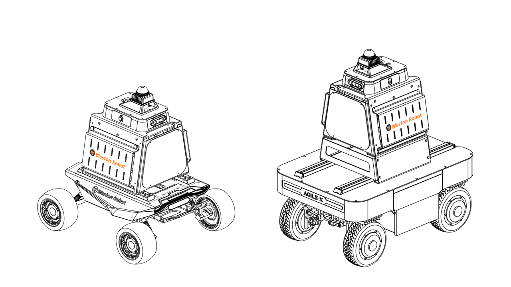

# UGV Development Kit V1.1 Bringup



## Overview
This package contains launch and config files to launch Weston Robot's UGV Development Kit V1.1 (chassis).

## Usage
To launch the UGV Development Kit V1.1, use the provided launch file:
```bash
ros2 launch ugv_devkit_bringup chassis.launch.py
```

## Launch Files
* [chassis.launch.py](./launch/chassis.launch.py)
  | Argument              | Description                        | Default Value |
  | --------------------- | ---------------------------------- | ------------- |
  | use_namespace         | Whether to apply a namespace       | False         |
  | namespace             | Top-level namespace                | ""            |
  | chassis_extension     | UGV Devkit Chassis Extension V1.1  | False         |

## Nodes
The package will launch the various sensors and their associated driver nodes/supporting nodes

* Description
  * Package: robot_state_publisher
  * Executable/Plugin: robot_state_publisher
  * Name: ugv_devkit_sensor_kit_state_publisher

## Configuration
To better suit your needs/setup, you may need to adjust these accordingly
* [Launch files](./launch/)